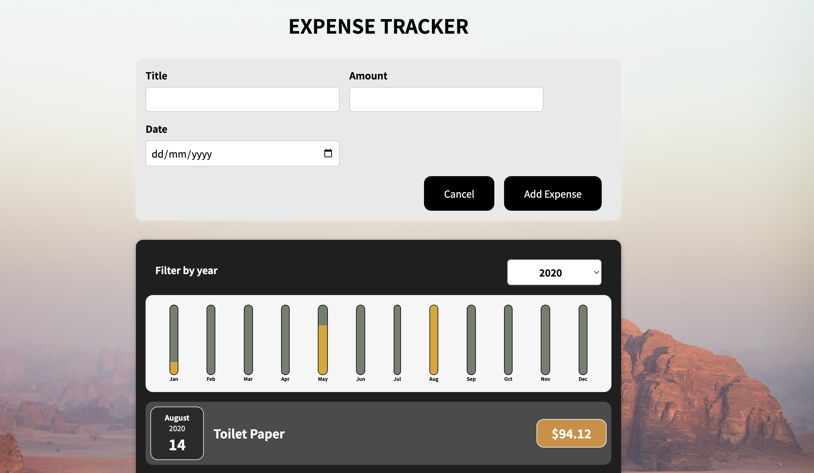

The Expense Tracker App is a simple and intuitive web application that allows users to track their expenses, manage budgets, and gain insights into their spending habits. With an easy-to-use interface and powerful features, users can efficiently manage their financial activities and make informed financial decisions.

Add and Categorize Expenses: Users can add new expenses.

View Expense History: Users can view a detailed history of their expenses, including date, category, and amount spent.

Responsive Design: The app is fully responsive and adapts to different screen sizes and devices for a seamless user experience.
Technologies Used:
HTML, CSS, JavaScript, React.js

Installation and Setup:

Clone the repository from [https://github.com/simonmec0/expense_tracker.git].

Navigate to the project directory and run npm install to install the required dependencies.

Run npm start to start the development server.

Access the app in your web browser at http://localhost:3000.

Thank you for using the Expense Tracker App!
We hope it helps you manage your expenses efficiently and achieve your financial goals.
Happy tracking!💸
